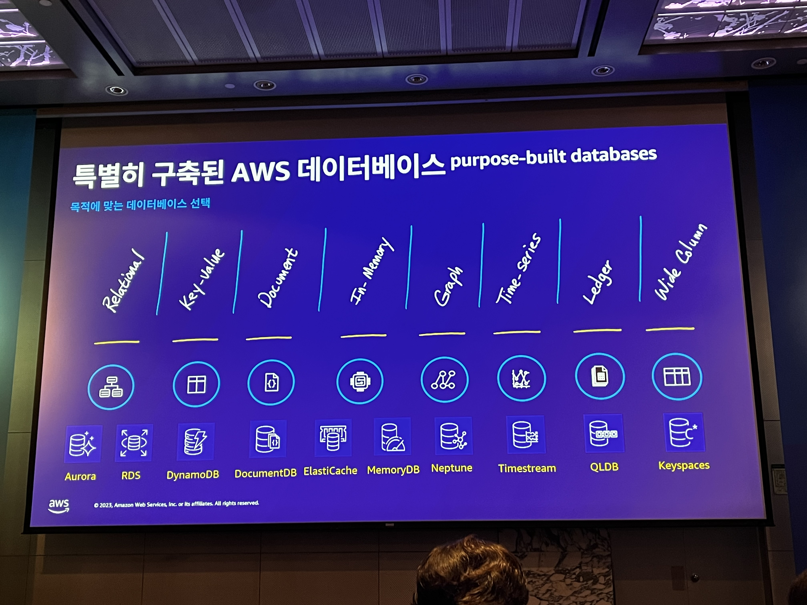
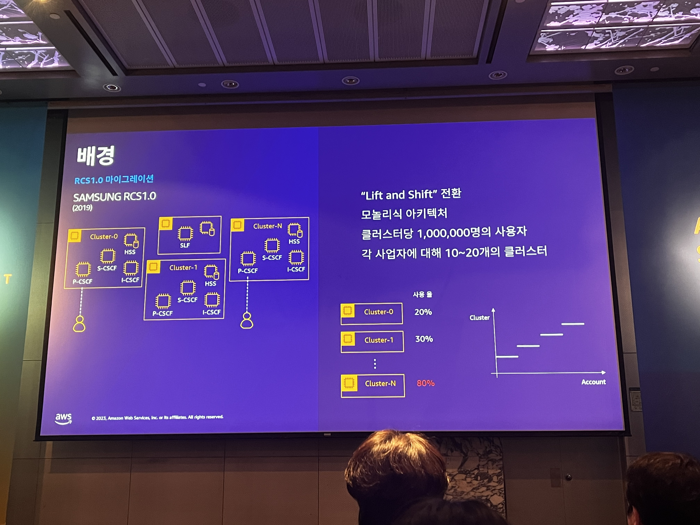
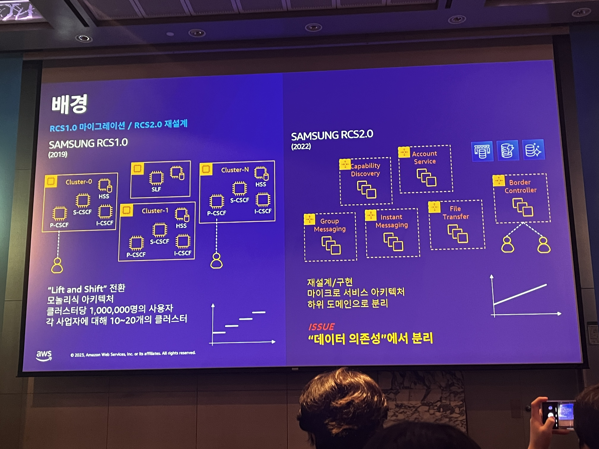
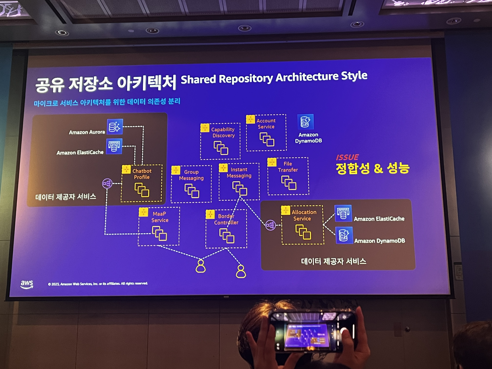
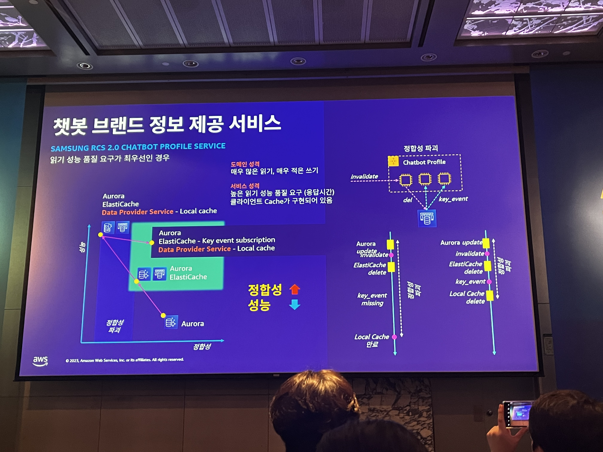
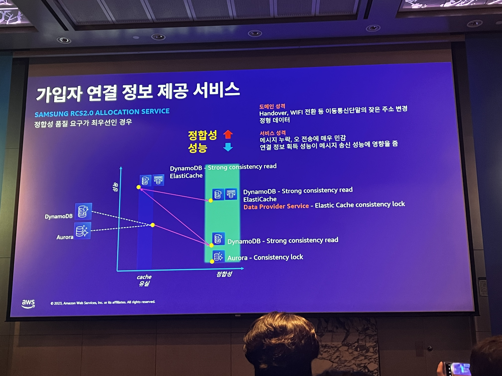
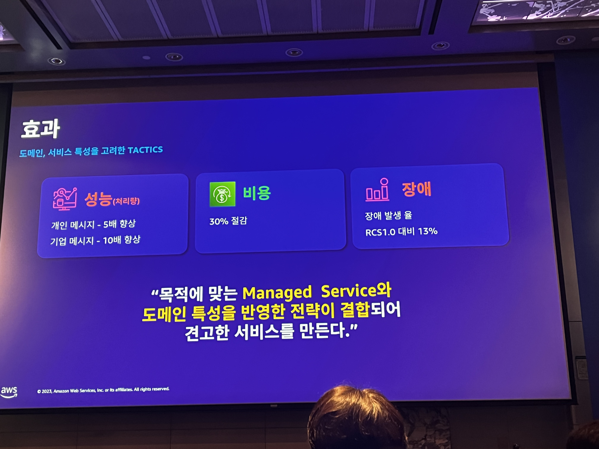

# 삼성전자/쿠팡의 대규모 트래픽 처리를 위한 클라우드 네이티브 데이터베이스 활용
* 하드웨어 및 소프트웨어 설치, 구성, 패치, 백업
* 성능 및 고 가용성 문제
* 컴퓨팅 및 스토리지를 위한 용량 계획 및 확장 클러스터
* 보안 및 규정 준수

### 삼성의 사례

### 쿠팡의 사례

### 특수 목적 고려할 요소
* 어플리케이션 워크로드
* 데이터의 형태
* 어플리케이션 성능 요구 사항
* 운영 부담