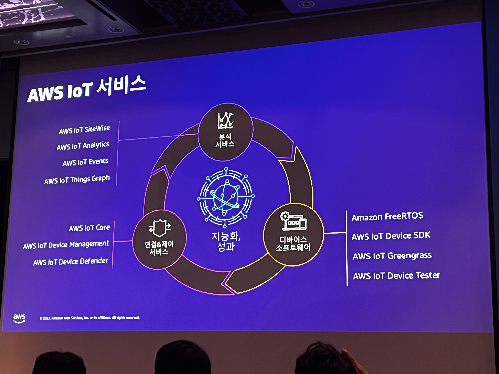
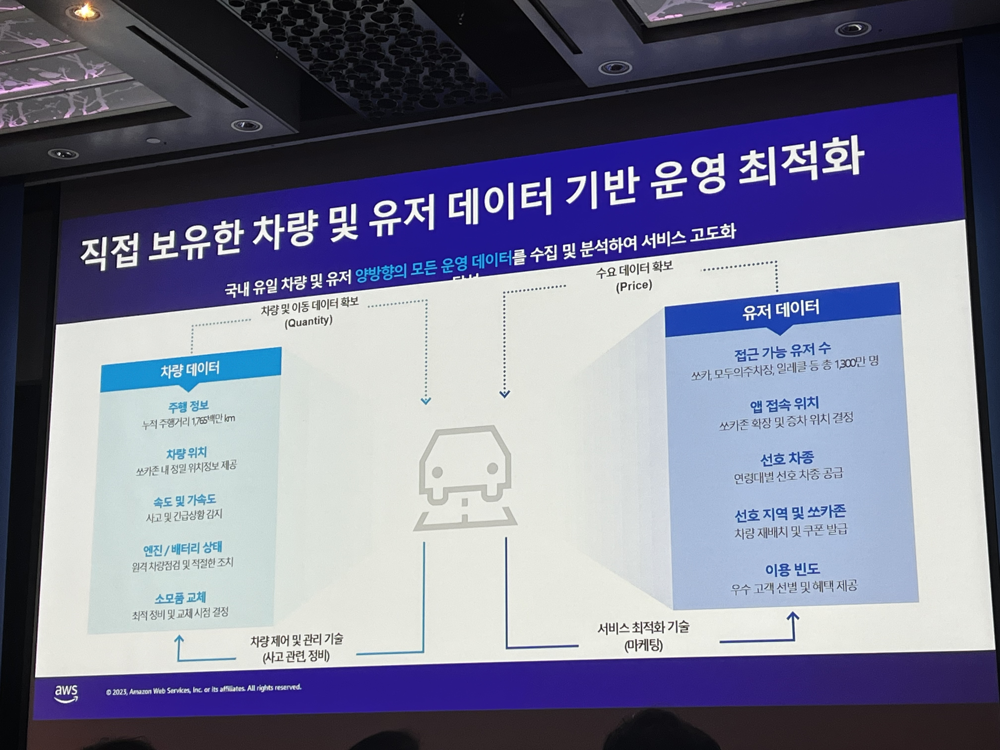
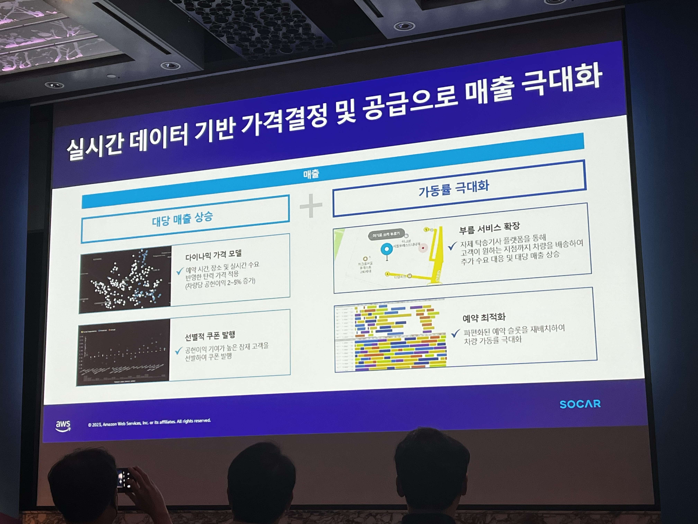
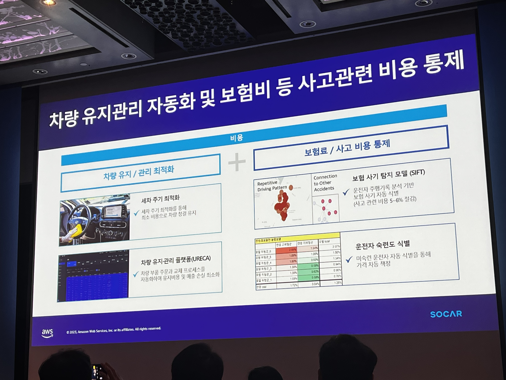
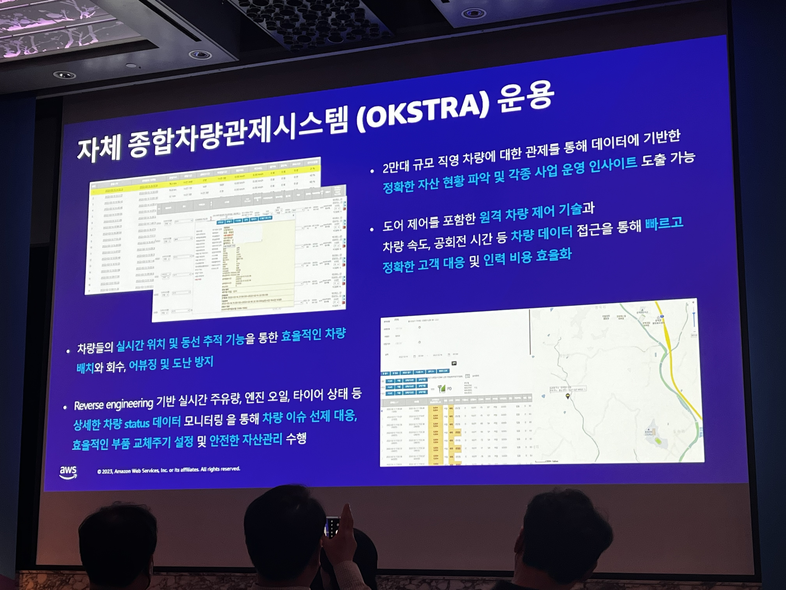
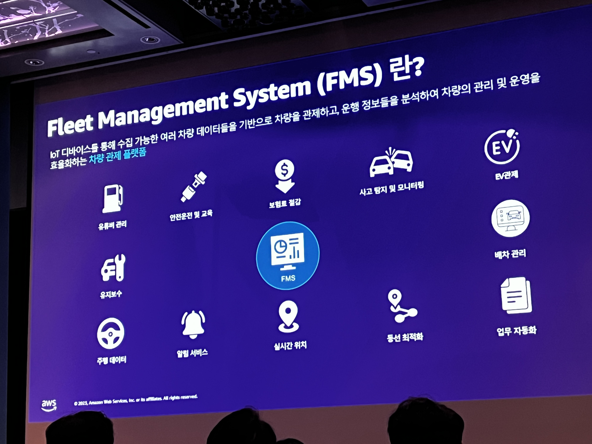
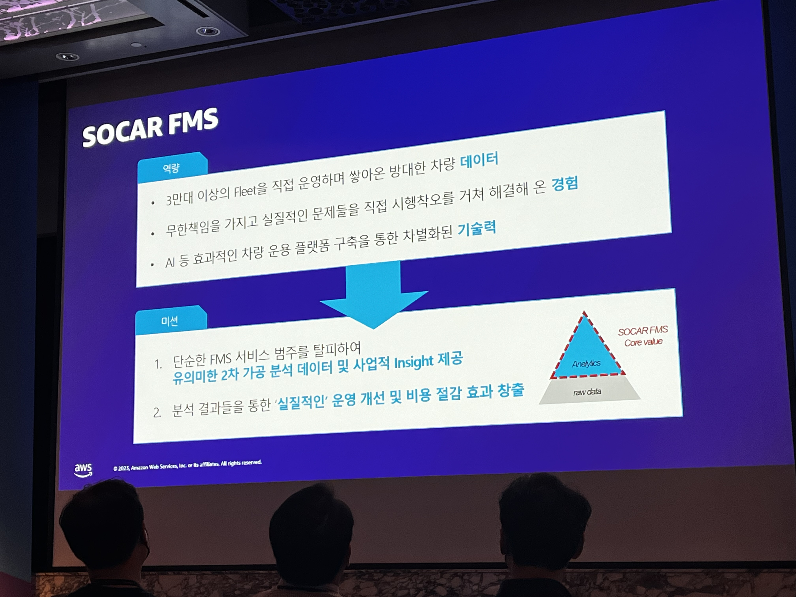
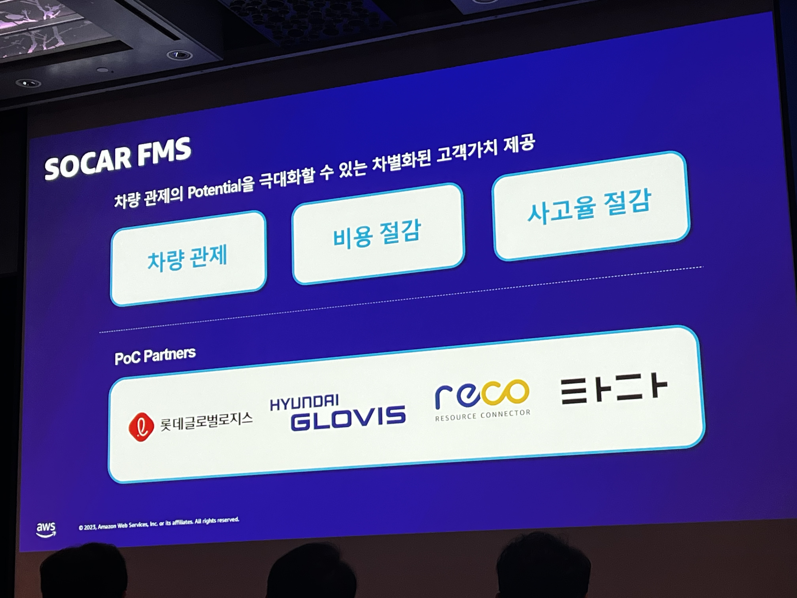
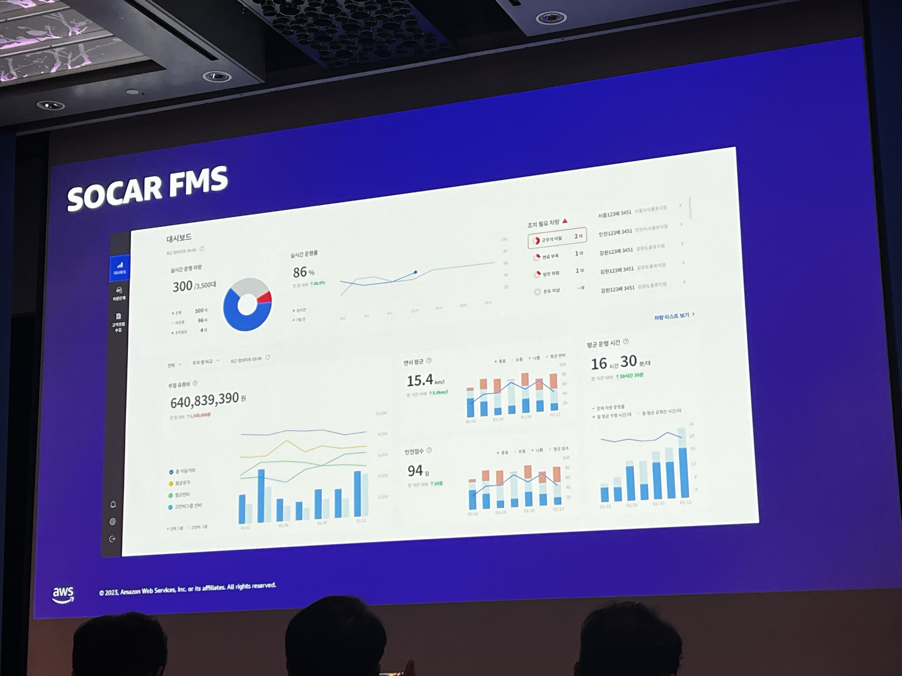

# SOCAR는 어떻게 2만대의 차량을 운영할까?: IoT Data의 수집부터 분석까지
## 다양한 산업에서의 IoT 중요성
### 제조 산업 트렌드
* 데이터는 석유 그 이상
* 디지털로 실행되는 제조업
* 서비스로의 제품 (Product-as-a-service)
* 스마트 제품
* 지속 가능성

### IoT 솔루션의 복잡성
* 디바이스 & 센서
  * 온보딩
  * 프로비저닝
  * 관리
* 연결성 & 인프라
  * 연결
  * 커뮤니케이션
  * 보안
* 분석 & 통찰력
  * 분석
  * 시각화
  * 조치
* 어플리케이션 & 서비스
  * 참여
  * 권한부여
  * 경험
* 변화 관리
  * 변화
  * 혁신 문화
## SOCAR의 Carsharing과 FMS로 그리는 미래

## 기술로 풀어보는 IoT 데이터
### IoT 디바이스가 직면한 문제
* 물리 차량 댓수 증가
* RESTful API 서버의 한계
* 관리, 비용 이슈

### 힘겨워하는 Aurora
* IoT Data 적재량 증가
* CPU, Memory, Disk 사용량 증가
* 빈번한 데이터 적재 누락
* 쓰기 지연 발생
* 타 서비스 영향 발생
### 데이터 파이프라인

#### 스트림 구성
요구 사항
* 서비스 분석 등을 위해 재사용 가능한 IoT 데이터
* 어떠한 종류의 데이터베이스에도 데이터 적재
* 쉬운 데이터 파이프라인 추가 & 변경
* => Data Stream 구성 의사 결정

숙제들
* 20000여대의 차량이 동시에 전송하는 데이터 핸들링
* 어떠한 상황에서도 높은 성능 유지
* 유연한 Message Protocol 핸들링
* 여러가지 변경 (추가, 수정)에 유연하게 대응
  * Kafka Topic
  * Message Protocol
  * Database

