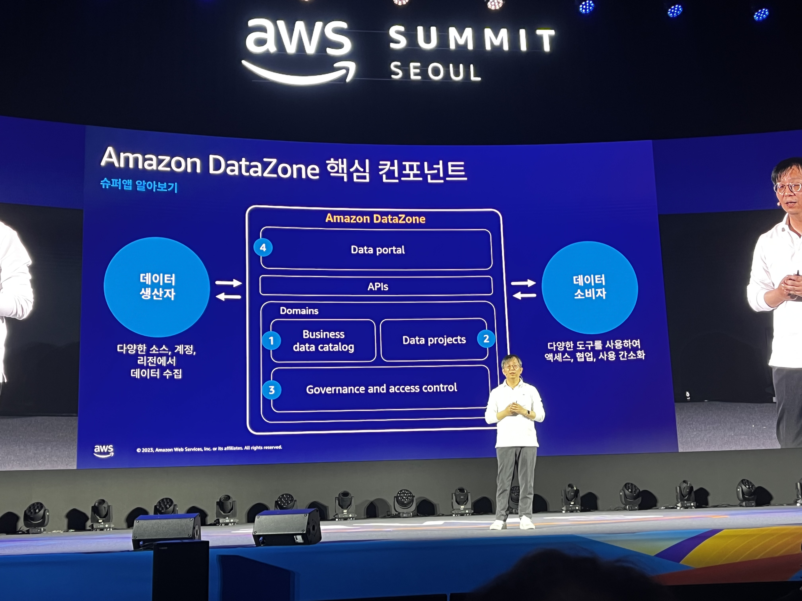

# 비즈니스 경계를 허무는 혁신: 단 하나의 선택, 슈퍼앱
슈퍼앱은 대부분 결제 서비스를 포함

## 슈퍼앱 알아보기
* 사용성 편의성 증대
* 시장 점유율 확대
* 수익 증대
  * 앱 내에서 체류 시간 증가
  * 광고 수익, 인 앱 결제 등 다양한 수익 모델을 활용
* 신규 비즈니스 기회 제공

* 미니앱의 사용자 검색 및 활성화
* 미니앱을 위한 설계 및 개발 프레임워크
* 미니앱 생태계를 위한 발행 매커니즘
* 슈퍼앱과 미니앱 간의 생태계 공유

### Amazon DataZone

## KB스타뱅킹, 슈퍼앱으로의 진화
### 슈퍼앱 등장 배경
* 고객 니즈
  * 비대면 선호 추세
  * One-App으로 니즈 해결 욕구
* 경쟁 환경
  * 은행과 IT 기업과의 경계가 희미해지는 빅블러 경쟁 심화
  * 플랫폼 주도권 확보 경쟁
* 규제 환경
  * 진입 규제 완화
  * 부수/겸영 업무 확대 증 규제 개선 공감대 형성

### KB가 바라본 슈퍼앱 정의
고객 가치 실현을 위해 금융에 본질을 두고 그룹을 연결하며 생활을 아우르는 플랫폼

## 컬리페이, 세상에게 이득!

