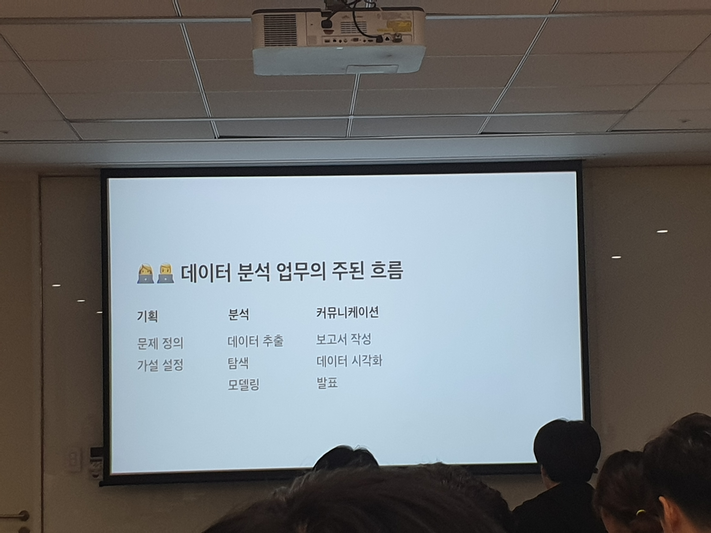
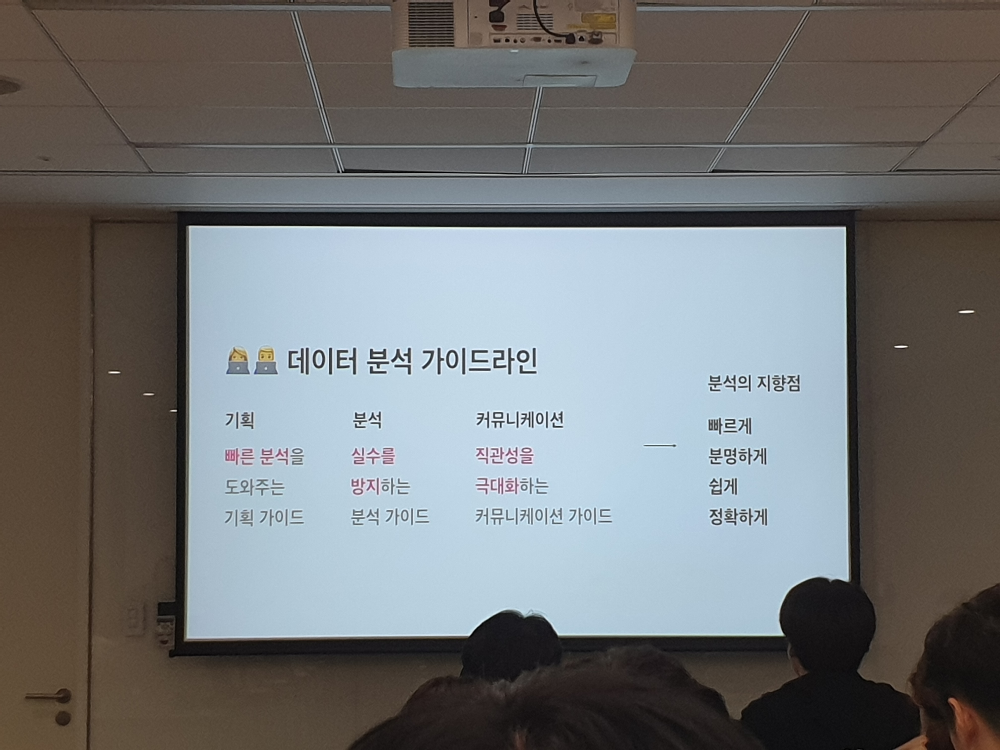
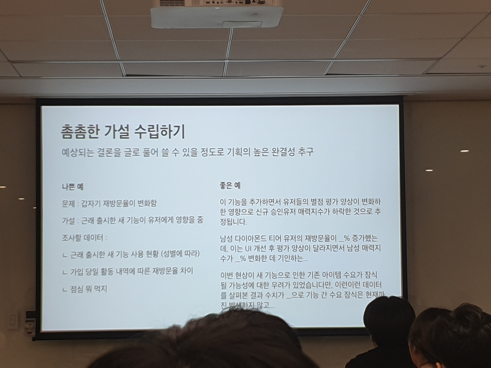
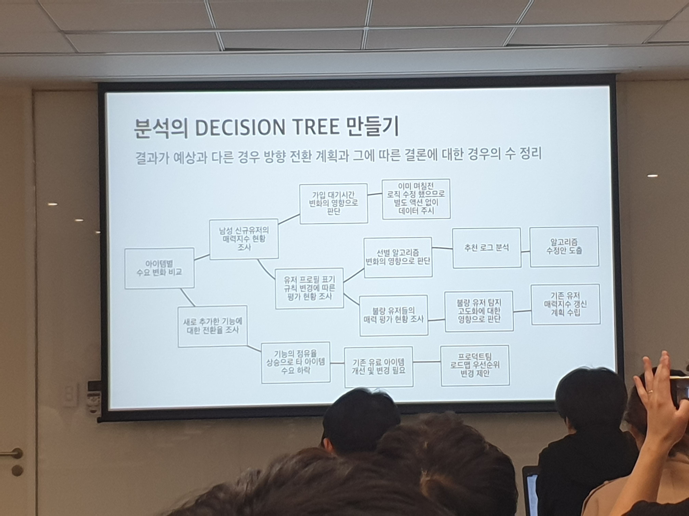
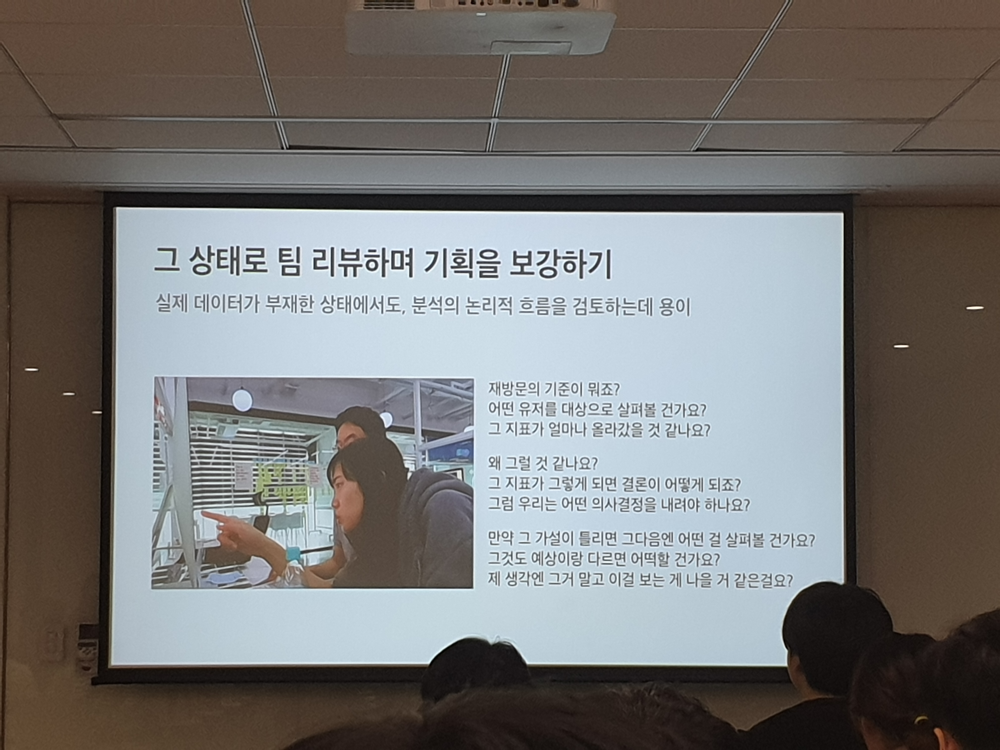
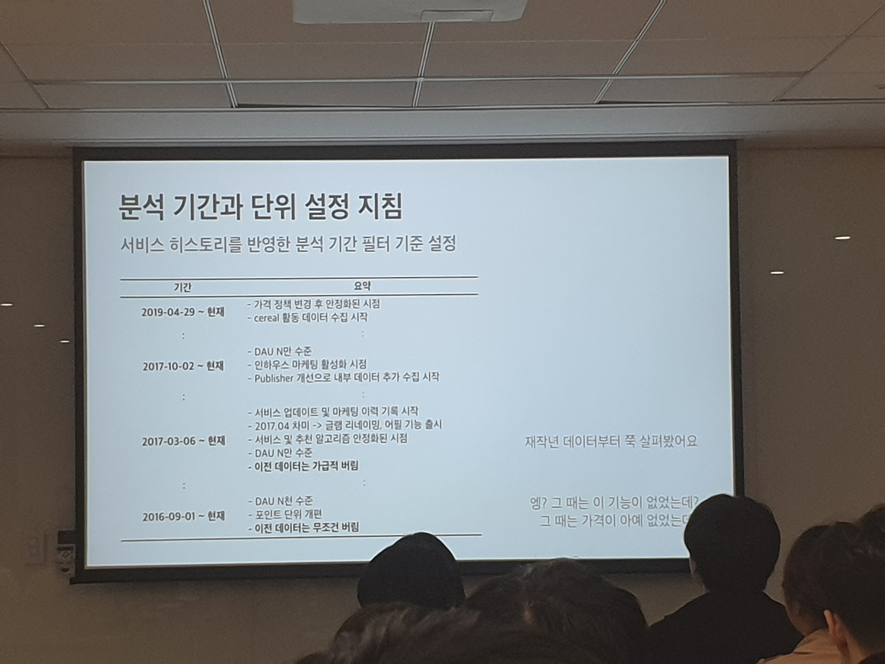
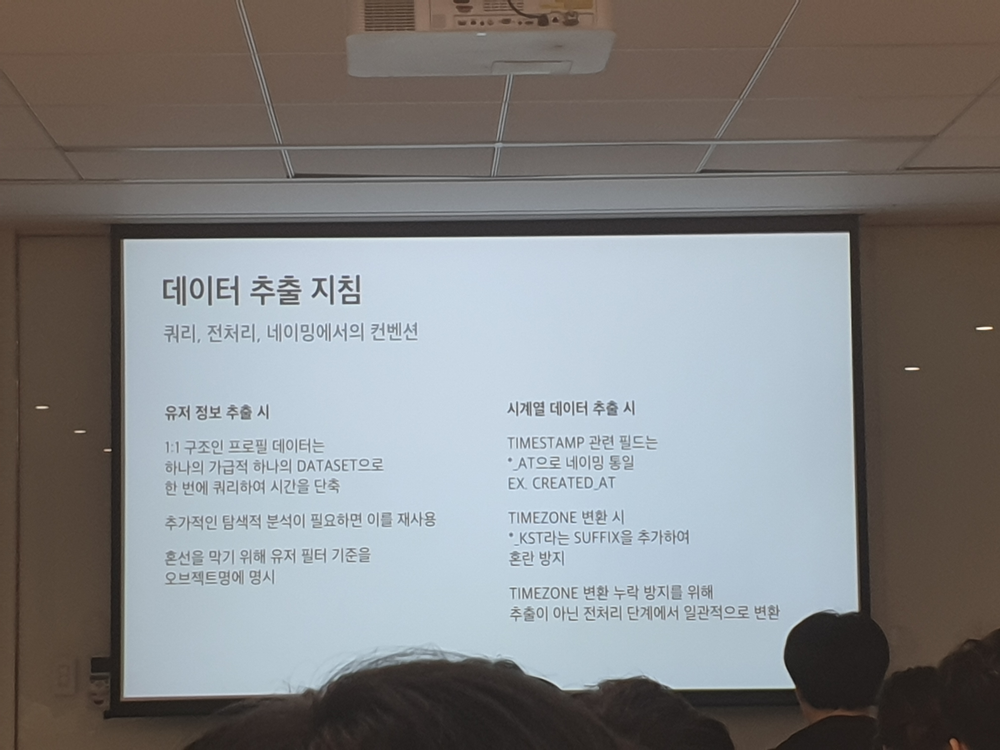
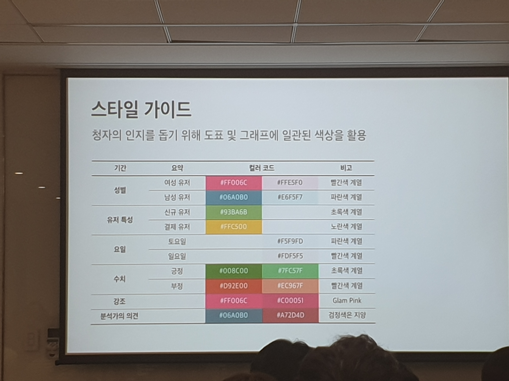

# 분석과 커뮤니케이션의 시행착오를 줄이는 데이터 문화 만들기
* 분석의 관점에서 회사와 서비스를 이해하고
* 분석의 "지향점"과 "덜지향점"을 구체화
* 분석을 위한 실무 가이드라인을 만들자

## 분석의 관점에서 회사와 서비스를 이해하고
* 분석의 관점에서 우리 서비스는...
  * 성별별로 다른 유저 경험
    * 문화나 성별에 따른 행동 양상을 구분한 접근이 중요
  * 까다로운 가입 절차
  * 불량 유저 철퇴
* 분석의 관점에서 우리 회사는...
  * 엄청 빠른 의사결정
  * 일상화된 데이터 기반 의사결정
  * but 다른 구성원들의 제한적인 데이터 접근성

## 분석의 "지향점"과 "덜지향점"을 구체화하고
### 지향점
* 빠르게
  * 3일 이상 기다리게 하지 않는다
  * 넓고 얕은 분석
* 분명하게
  * 발견한 내용을 바탕으로 결론
  * 분석의 결론은 WHAT TO DO
  * DO
    * 데이터를 통해 얻은 인사이트를 빠짐없이 전달
* 쉽게
  * 가장 데이터 리터리시가 낮다고 생각되는 사람을 충분히 이해시킬 수 있도록
  * 전문용어 X
  * 좋은 그래프
* 정확하게
### 비지향점
* 깊고 상세한 분석
* 좋은 코드(...)

## 분석을 위한 실무 가이드라인을 만들자

### 빠른 항해를 도와주는 기획 가이드
* 표류의 지름길
  * 다짜고짜 데이터 추출부터 하기
  * 후행지표를 계획 없이 무작정 분석하기
* 촘촘한 가설 수립하기
  * 글로 풀 수 있을 정도로 기획의 높은 완결성 추구
    * 진짜 글로 가설을!
    
    * 뭘 집중해서 봐야하는지 찾아내는데 도움이 됨
    * 찾아야 될 데이터는 빈칸으로
* 분석의 Decision Tree 만들기
  * 가설이 틀렸을 경우 방향 전환 계획과 그에 따른 결론에 대한 경우의 수 정리
  
* 그 상태로 팀 리뷰하며 기획을 보강
  * 실제 데이터가 없어도 분석의 논리적 흐름을 검토하는데 용이
  
* 충분히 준비된 상태로 데이터를 살펴보기 시작하면 분명한 결론까지 빠르게 도달할 수 있다!

### 실수를 방지하는 분석 가이드
* 분석 기간과 단위 설정 지침
  * 서비스 히스토리를 반영한 분석 기간 필터 기준 설정
  
  * 통일된 기간 단위를 선정하여 혼선을 방지
    * 한주가 일요일에 시작할까? 월요일에 시작할까?
* 데이터 추출 지침
  * 쿼리, 전처리, 네이밍에서의 컨벤션
  
* 유저 필터 및 분류 지침
  * 서비스 특성을 고려한 유저 분류를 일관성 있게 적용
### 직관성을 극대화하는 커뮤니케이션 가이드
결과를 전달할 떄...
* 용어 가이드
  * 청자의 혼동을 막기 위해 정확한 용어를 사용
    * 가급적 한글을 사용하고 약어 사용 금지
    * 애매한 용어 사용 금지
    * 새로운 지표를 산출할 경우 풀어쓰는게 원칙, 필요 시 연산식을 반드시 명시
  * 구성원들이 빠른 이해!
* 스타일 가이드
  * 청자의 인지를 돕기 위해 도표 및 그래피에 일관된 색상을 활용
  
  
### 분석가가 분석을 잘 할수 있도록!