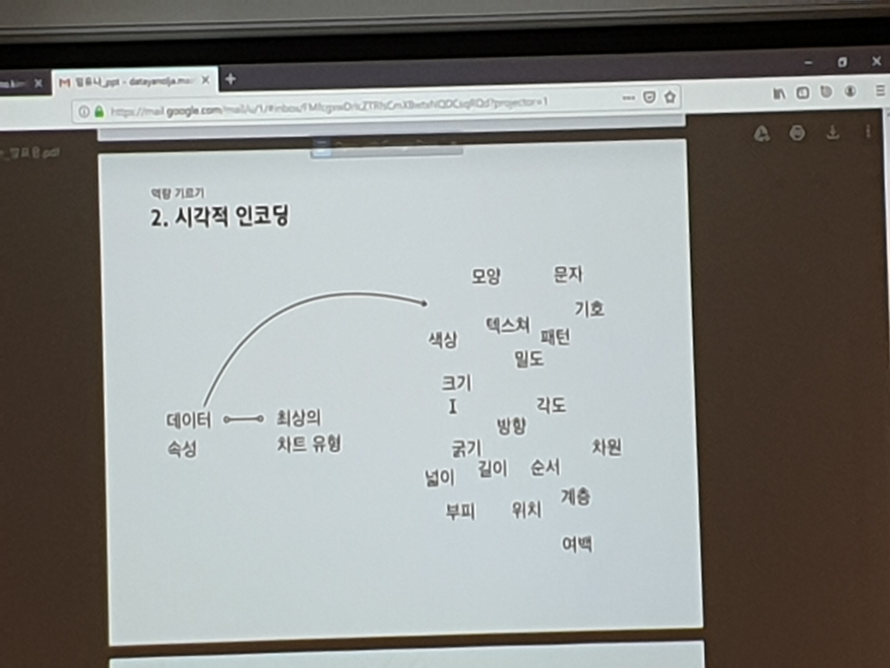

# 나의 리터러시 ≠ 너의 리터러시 : 잘 전달하기 위해 데이터 시각화

* 나와 다른 사람들에게 어떻게 데이터를 잘 전달할 것인가?

대상에 따른 이해도 차이가 각각 다를 수 있음

잘 전달하기 위해서...
* 다양한 스케치 + 테스트 + 논의

모바일의 콘텐츠 이해도가 낮음

색상 고려?

시각화에서 색은 정보 전달 목적으로만 사용 
색은 3~5로 사용 제한. 4 정도가 적당.

월스트리트 인포그래픽 가이드

역량 기르기
* 기본기 + 자료 많이 보고, 스크랩
* 시각적 인코딩 

* 컬러 툴 활용..
  * ColorPick Eyedropper
  * ColorBrewer
  * Chroma.js
* 컬러 상징 활용
* 체크리스트 활용 
