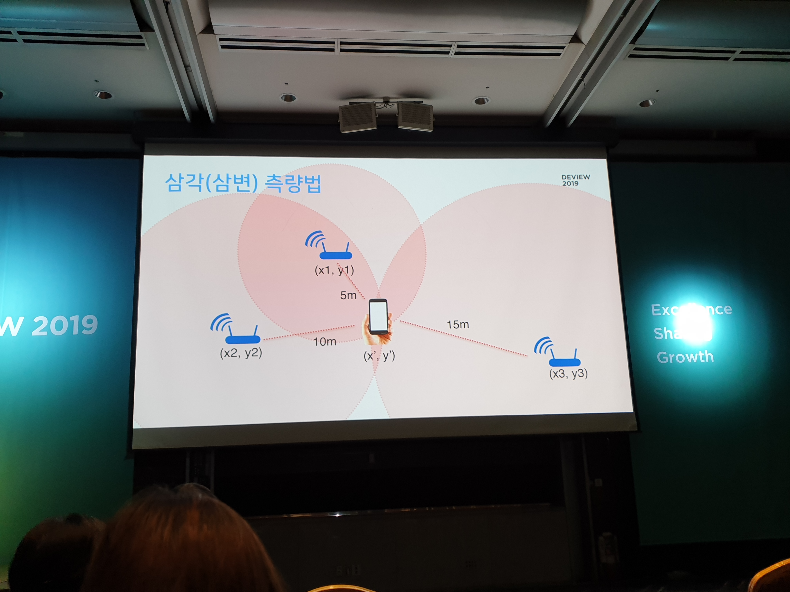
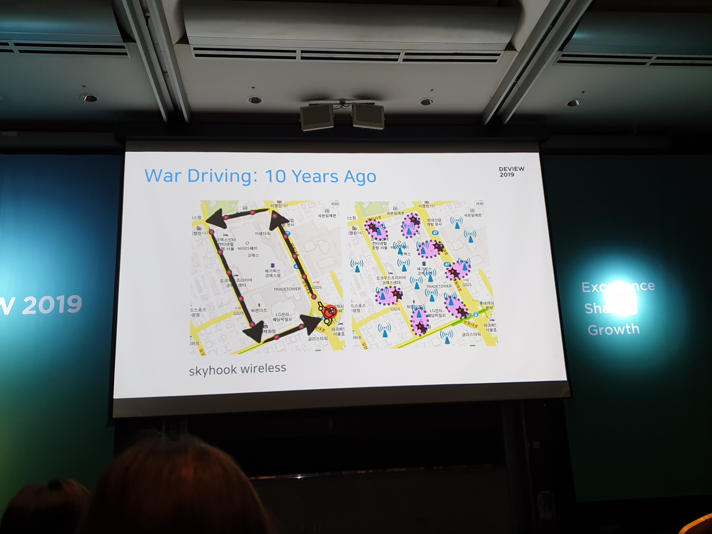
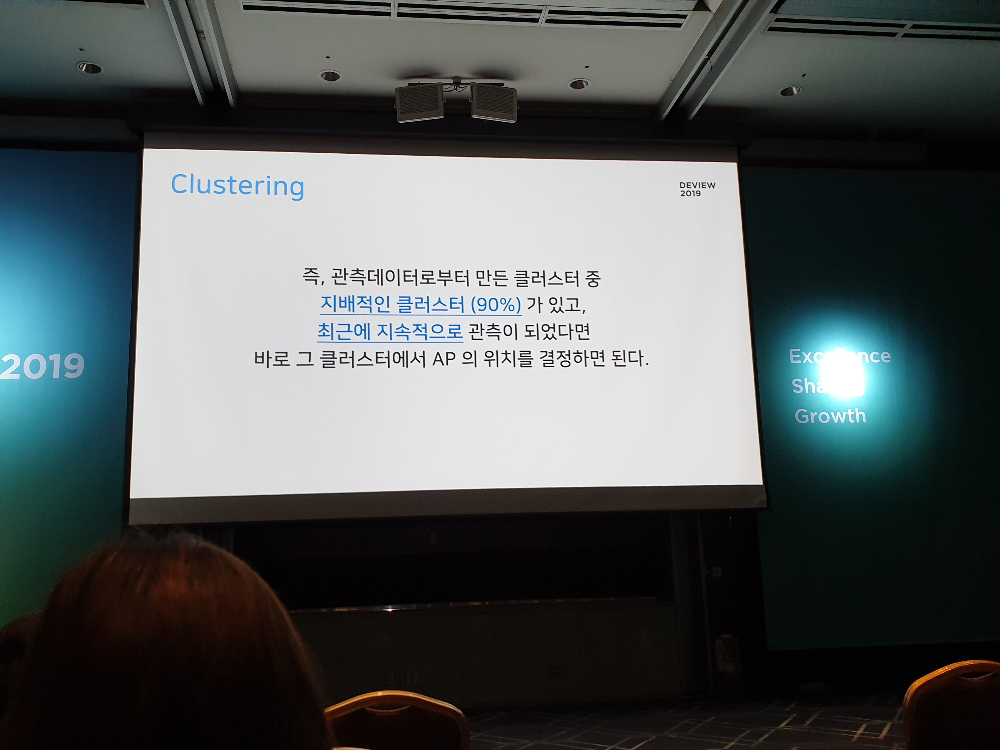

# 30억건의 사용자 위치기록으로 전국 3000만개의 WiFi AP MAP 구축하기 [#](https://deview.kr/data/deview/2019/presentation/[131]30억건의%20사용자%20위치기록으로%20전국%203000만개의%20WiFi%20AP%20MAP%20구축하기.pdf)

도심에서는 GPS의 정확성이 떨어짐 => WPS와 결합하여 사용

WPS?
* WiFi Positioning System
* WiFi에 대한 기본 정보

실내: Fingerprint를 촘촘하게 
전국: AP 위치를 찾는게 유리

전국 단위 AP 위치 수집?

빽빽하게 Route를 정하면 정확한 AP 위치 수집 가능

근데 AP가 한 장소에 고정되어 있는 것만은 아님 
=> 클러스터링

들어오는 데이터가 너무 많았는데...
=> BigQuery 사용

https://developers.loplat.com/wps/

