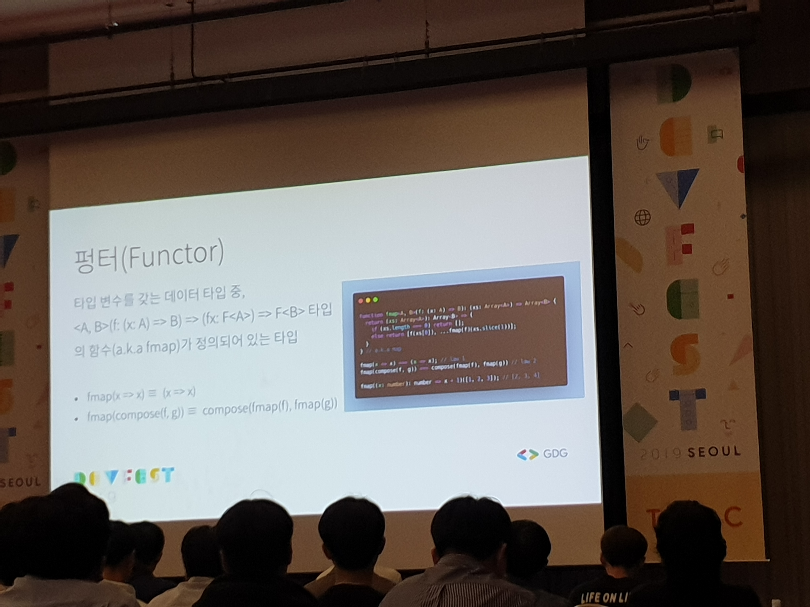
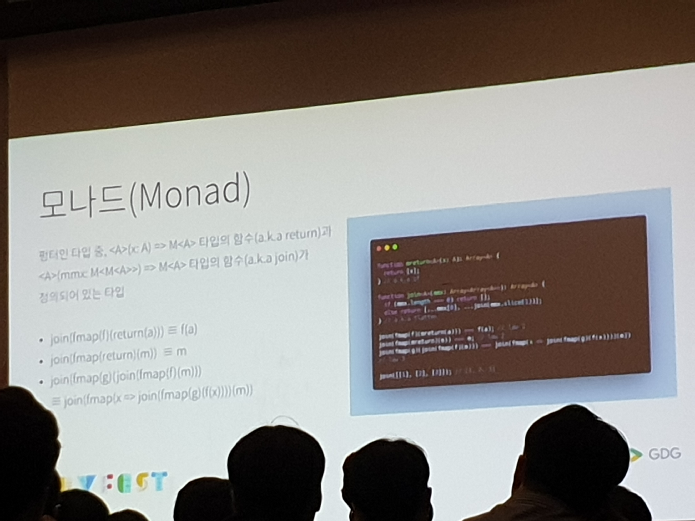

# 프로그래밍의 미래, 함수형 프로그래밍
## 함수형 프로그래밍?
* 프로그램을 수학적 함수로 보는 패러다임
* 기존 패러다임의 문제
  * 숨겨지는 변이
    * 변이와 상태는 다른 코드의 동작에 영향
    * => 프로그램의 동작을 예측하기 어렵게 함
    * => 함수형 프로그래밍은 상태 변화를 금지
* 수학에 기반한 아름다운(?) 프로그래밍
* 함수도 일반적인 값
* 순수 함수
  * 사이드 이펙트
    * 상태를 변이시키는 동작
  * 사이드 이펙트를 일으키지 않아야
  * 참조 투명성
* 고차 함수
  * 함수를 반환하거나 인자로 받는 함수
* 함수 합성
  * 함수를 합치는 행위
  * 커링
    * 매개 변수가 여럿인 함수를 매개변수가 하나인 함수의 연속으로 바꾸는 기술
    * 재사용성이 높아진다고?
* 모노이드
  * 데이터 타입 중 (x : A, y : A) => A 타입의 함수가 정의되어 있는 타입
  * 데이터 타입의 값 중 하나를 항등원으로
  * 결합법칙 준수
* 펑터
  
  * A 타입을 다루는 함수를 F<A> 타입을 다루는 함수로 변환시키고 싶을 때
* 모나드
  
  * 문맥 표현
    * 값과 타입으로 표현
      * 값과 타입으로 모델링한 문맥에 들어있는 값은 문맥을 해석하는 작업을 필요로 함
      * => 중복 코드 지옥
      
## fp-ts?
* 다른 함수형 언어가 지원하는 기능들이 구현되어 있음
* 높은 퀄리티의 타이핑
* Maybe, State, Either 등 중요한 타입 지원
* Algebraic Data Type (ADT)
  * 다른 타입으로 구성되는 타입의 한 부류
  * => 구분 가능한 튜플들의 유니온 타입
* 타입 클래스
  * 타입의 클래스
  * 함수(연산)를 기준으로 타입을 구별하기 위해 사용
* Higher Kinded Type (HKT)
  * 제네릭 타입을 타입 생성자로 보았을 떄의 생성자
  * 타입 변수의 수에 따라 구별
  * 하스켈은 직접적으로 다룰 수 있음
  * TS는 직접적으로 안됨
  
## 함수형 프로그래밍으로 행복해지기(???)
* 실패할 수 있는 함수
  * Maybe 모나드
    * 실패할 수 있다는 문맥을 추상화
    * 더 아름다운 실패 처리
* 인자가 중복될 때
  * ((->) r) 모나드
    * 같은 값을 사용한다는 문맥을 추상화하는 모나드